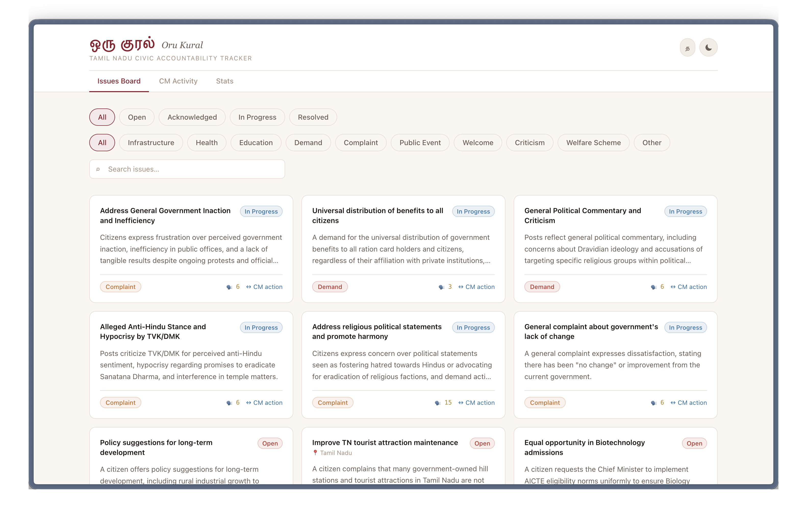
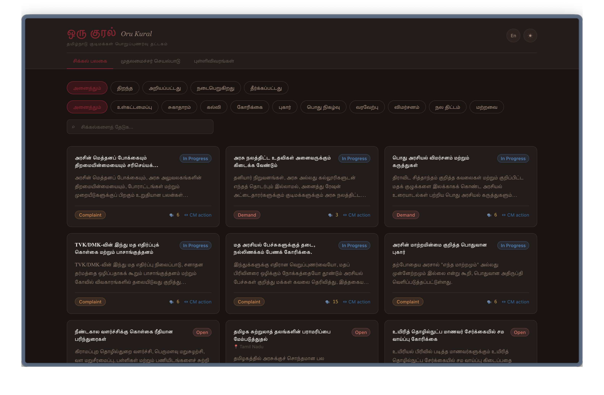
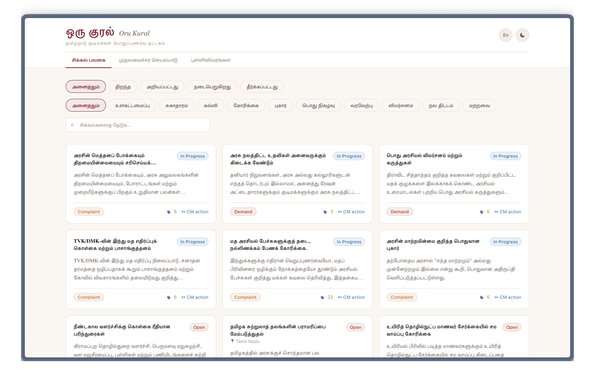
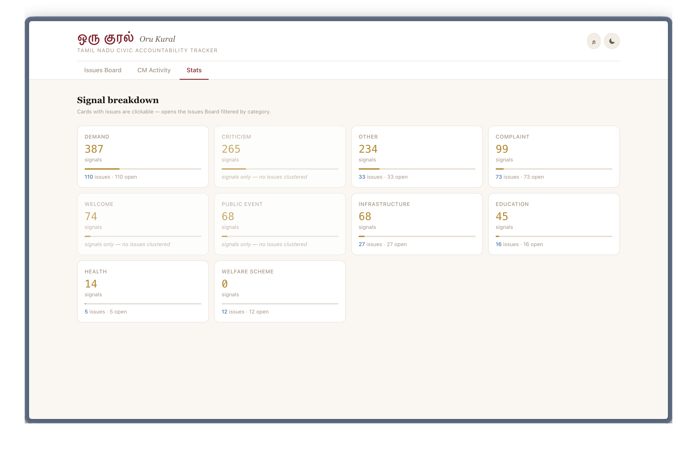

# ஒரு குரல் — Oru Kural

**One Voice** — A civic tech window into what Tamil Nadu citizens are saying to their Chief Minister.

Oru Kural scrapes public posts mentioning `@CMOTamilnadu` from X and Reddit, uses Gemini AI to categorize and cluster them into structured civic issues, tracks official CM press releases, and surfaces everything in a live three-tab dashboard — turning social media noise into structured civic signal.

---

## Screenshots



<br/>

<table>
  <tr>
    <td></td>
    <td></td>
  </tr>
  <tr>
    <td align="center"><sub>Dark mode</sub></td>
    <td align="center"><sub>Tamil language toggle</sub></td>
  </tr>
</table>

<br/>



<sub>Stats tab — signal breakdown by category, clickable cards filter the Issues Board</sub>

---

## Architecture

```
  X API v2          Reddit JSON         TN Gov / The Hindu RSS
      │                  │                        │
      ▼                  ▼                        ▼
 scrape_tweets.py   scrape_reddit.py    scrape_cm_events.py
      │                  │                        │
      └──────────────────┘                        │
                 │ upsert                  upsert  │
                 ▼                                 ▼
         Supabase (PostgreSQL)           cm_events table
          signals table
                 │
                 ▼
     categorize_signals.py   ← Gemini Flash (batch 40)
                 │ update category + confidence
                 ▼
          cluster_issues.py  ← Gemini (semantic clustering)
                 │ creates issues table rows
                 ▼
     link_events_to_issues.py ← Gemini (links cm_events ↔ issues)
                 │
                 ▼
         Axum REST API  :3000 (local) / :8080 (Fly.io)
           GET /issues      GET /events
           GET /issues/:id  GET /stats
           GET /signals
                 │
                 ▼
     Dioxus 0.7 WASM Dashboard  :8080 (local)
     Issues Board · CM Activity · Stats
```

---

## Tech Stack

| Layer | Technology |
|-------|-----------|
| Data pipeline | Python 3.11+ async (httpx) |
| AI categorization | Google Gemini 2.5 Flash (via `llm.py` abstraction) |
| Database | Supabase (PostgreSQL + PostgREST) |
| Backend API | Rust + Axum (thin Supabase proxy, no direct DB) |
| Frontend | Rust + Dioxus 0.7 (compiles to WASM) |
| CSS | Tailwind v4 (`@tailwindcss/cli`) |
| Backend hosting | Fly.io (Mumbai region, auto-scale to 0) |
| Frontend hosting | Vercel (SPA, rewrites to index.html) |
| Automation | GitHub Actions (weekly cron, Monday 2am UTC) |

---

## Local Development Setup

### 1. Clone

```bash
git clone https://github.com/bunnyBites/oru-kural.git
cd oru-kural
```

### 2. Environment variables

```bash
cp .env.example .env
```

Fill in your values:

| Variable | Where to get it |
|---|---|
| `SUPABASE_URL` | Supabase dashboard → Project Settings → API |
| `SUPABASE_ANON_KEY` | Supabase dashboard → Project Settings → API (publishable) |
| `SUPABASE_SERVICE_ROLE_KEY` | Supabase dashboard → Project Settings → API (secret) |
| `GEMINI_API_KEY` | [Google AI Studio](https://aistudio.google.com) |
| `X_BEARER_TOKEN` | [developer.x.com](https://developer.x.com) → App → Bearer Token |
| `PORT` | Set to `3000` for local dev (backend); Fly.io uses `8080` |
| `RUST_LOG` | Backend log level, e.g. `info` or `oru_kural_backend=debug` (default: `info`) |

### 3. Supabase: run all migrations

Open the [Supabase SQL Editor](https://supabase.com/dashboard/project/_/sql) and run each file in order:

```
supabase/migrations/002_scale_indexes_and_scrape_runs.sql
supabase/migrations/003_category_stats.sql
supabase/migrations/004_retention_archive.sql
supabase/migrations/005_categorization_failures.sql
supabase/migrations/006_v3_schema.sql
supabase/migrations/007_signals_table.sql
supabase/migrations/008_anon_read_policies.sql   ← required for backend reads
```

> **Important:** Migration `008` adds RLS `SELECT` policies for the `anon` role on all public tables. Without it, the backend (which uses `SUPABASE_ANON_KEY`) returns empty arrays even when data exists.

### 4. Python pipeline

```bash
cd scripts
python -m venv .venv
source .venv/bin/activate      # Windows: .venv\Scripts\activate
pip install -r requirements.txt
```

Run the full pipeline once to seed data (subsequent runs are automated weekly):

```bash
python scrape_tweets.py        # fetch X posts → signals table
python scrape_reddit.py        # fetch Reddit posts → signals table
python scrape_cm_events.py     # fetch TN Gov + The Hindu RSS → cm_events table
python categorize_signals.py   # Gemini: categorize uncategorized signals
python cluster_issues.py       # Gemini: cluster signals into issues
python link_events_to_issues.py # Gemini: link cm_events ↔ issues
```

Dry-run mode (skip API, load local JSON):
```bash
python scrape_tweets.py --dry-run path/to/file.json
```

### 5. Backend

```bash
cd backend
# .env is read from the repo root via dotenvy
cargo run
# → http://localhost:3000
```

### 6. Frontend

Open two terminals:

```bash
# Terminal 1 — compile Tailwind (watch mode)
cd frontend
npm run css

# Terminal 2 — Dioxus dev server
cd frontend
dx serve
# → http://localhost:8080
```

> **Port note:** The backend runs on `:3000` and the frontend dev server on `:8080`. The frontend's `API_BASE` defaults to `http://localhost:3000` at compile time. For production, set `API_BASE_URL` to your Fly.io backend URL before building.

---

## API Reference

All routes return JSON. No authentication required (read-only, anon key via backend).

| Method | Route | Query params | Response |
|--------|-------|-------------|----------|
| `GET` | `/health` | — | `{ status, service }` |
| `GET` | `/issues` | `status`, `category`, `location`, `search_query`, `limit`, `cursor` | `PagedResponse<Issue>` |
| `GET` | `/issues/:id` | — | `{ issue, signals[], linked_event? }` |
| `GET` | `/signals` | `source`, `category`, `q`, `limit`, `cursor` | `PagedResponse<Signal>` |
| `GET` | `/events` | `category`, `linked`, `limit`, `cursor` | `PagedResponse<CmEvent>` |
| `GET` | `/stats` | — | `{ data: CategoryStat[] }` |
| `GET` | `/meta` | — | `{ last_scrape_at, last_scrape_status }` |

- Pagination uses keyset cursors (base64-encoded timestamps). No `OFFSET`, no `COUNT(*)`.
- `limit` is clamped to `[1, 100]` server-side.
- `search_query` runs a case-insensitive `OR` match across `title` and `summary`.
- Every response carries an `X-Request-Id` header (UUID v4) for log correlation.

---

## Deployment

### Backend — Fly.io

```bash
fly deploy          # uses Dockerfile at repo root
fly secrets set SUPABASE_URL=... SUPABASE_ANON_KEY=... FRONTEND_ORIGIN=https://your-vercel-url.vercel.app
```

The Fly app runs on port `8080` internally (`PORT=8080` set in `fly.toml`).

### Frontend — Vercel

Set a build environment variable in the Vercel project dashboard:

```
API_BASE_URL = https://oru-kural-backend.fly.dev
```

Then push to `main` — Vercel picks up `vercel.json` and builds automatically.

### Automation — GitHub Actions

Pipeline runs **twice a week** — Monday and Thursday at 2am UTC (7:30am IST) — via `.github/workflows/weekly_scrape.yml`. Set these repository secrets:

```
SUPABASE_URL
SUPABASE_ANON_KEY
SUPABASE_SERVICE_ROLE_KEY
GEMINI_API_KEY
X_BEARER_TOKEN
FLY_API_TOKEN          ← for auto-deploy workflow
ALERT_EMAIL_USER       ← Gmail address that sends failure alerts
ALERT_EMAIL_PASSWORD   ← Gmail app password (not your login password)
ALERT_EMAIL_TO         ← recipient address for failure alerts
```

Trigger manually anytime via **Actions → Twice-Weekly Scraper → Run workflow**.

---

## Database Schema

Migrations `002–010` are applied. Never re-run `001` (initial tweets table, now superseded).

| Table | Purpose |
|-------|---------|
| `signals` | Unified citizen posts — X tweets + Reddit posts |
| `issues` | AI-clustered civic demands, keyed by category + location |
| `cm_events` | Official CM press releases scraped from RSS |
| `signal_issue_map` | Many signals → one issue |
| `category_stats` | Denormalized counts per category (tweet + issue counts) |
| `scrape_runs` | Pipeline observability — timestamps, counts, errors |

Applied migrations (in order): `002` indexes + scrape_runs · `003` category_stats · `004` retention · `005` categorization_failures · `006` v3 schema · `007` signals table · `008` anon RLS policies · `009` dedup index + duplicate_of column · `010` Tamil columns (`title_ta`, `summary_ta`)

---

## Known Issues & Gotchas

- **RLS must be configured** — migration `008` must be run in Supabase SQL editor. Without it, the anon key returns empty arrays from all tables (service role key bypasses RLS).
- **Port conflict in local dev** — backend uses `:3000`, `dx serve` uses `:8080`. The frontend `API_BASE` defaults to `localhost:3000`. Do not run the backend on `:8080` locally or requests will hit the Dioxus dev server.
- **`tailwind.css` is generated** — never edit `frontend/assets/tailwind.css` by hand. Run `npm run css` to regenerate. Badge colors use named CSS classes in `input.css`; other dynamic color values use inline `style=` (dynamic Tailwind class names are purged at build time).
- **Reddit uses public JSON API** — `scrape_reddit.py` uses Reddit's unauthenticated JSON fallback (`reddit.com/r/subreddit.json`). This is sufficient for the twice-weekly scrape volume and requires no credentials. No action needed.
- **`issues` table starts empty** — data only appears after running `cluster_issues.py` at least once. Scraping alone is not enough, clustering must run too.

---

## Phase Roadmap

| Phase | Status | Description |
|-------|--------|-------------|
| **1 — Data pipeline** | Done | X API v2 + Reddit scraping → Supabase, Gemini categorization |
| **2 — v3 Architecture** | Done | Unified signals table, issues clustering, CM events, Axum API, Dioxus 3-tab UI |
| **3 — Polish & observability** | Done | Dark mode, error banners, API retry, structured logging (`tracing`), request IDs, Supabase timeouts, search, rate limiting, compression, request ID headers, signal deduplication, incremental clustering |
| **4 — Signal expansion** | Partial | Grievance portal scraper done (`scrape_grievances.py`); Reddit OAuth (PRAW) pending credentials |
| **5 — Multilingual** | Done | Tamil/English toggle in header; `title_ta` + `summary_ta` columns; Gemini translation pass |
| **6 — Public engagement** | Planned | "Add your voice" — allow citizens to upvote issues via the UI |
